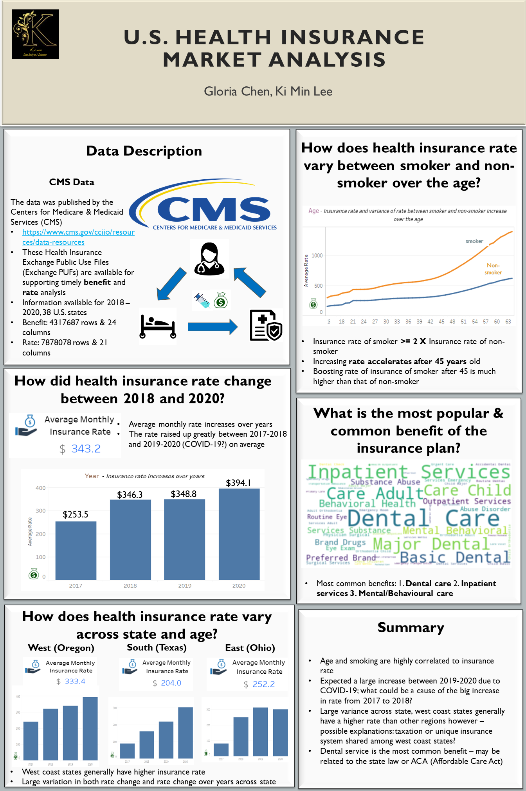

# US Health Insurance Rate Analysis

## Research Questions
The study will answer
1. How do health insurance rates vary across state?
2. How did health insurance rates change from 2018 to 2020? And how did Covid-19 impact on US health insurance market?
3. How do health insurance rates vary between smokers and non-smokers?

## Dataset Conversion & Technical Appendix
* Dataset Compression Into Parquet File: [csv_to_parquet](https://github.com/kilee722/us_health_insurance_rate/blob/main/csv_to_parquet.ipynb)
* Technical Appendix File: [Healthcare_appendix.ipynb](https://github.com/kilee722/us_health_insurance_rate/blob/main/Healthcare_appendix.ipynb)

##  Exploratory Data Analysis on 38 U.S. states' health insurance rate

1. Average rate of monthly individual health insurance slightly increases over years with a significant growth in the  rate from **2019 to 2020** by **14.8%**
2. Insurance rate and variance of rate between smoker and non-smoker increase over the age. From the **age over 45**, the variance of insurance between smoker and non-smoker significantly increased
3. The most common benefit in the U.S. is **Dental Care**

## Tableau Analytical Dashboard

<noscript></noscript><object class='tableauViz'  style='display:none;'><param name='host_url' value='https%3A%2F%2Fpublic.tableau.com%2F' /> <param name='embed_code_version' value='3' /> <param name='site_root' value='' /><param name='name' value='Health_Rate_Dashboard_Complete&#47;Dashboard1' /><param name='tabs' value='no' /><param name='toolbar' value='yes' /><param name='static_image' value='https:&#47;&#47;public.tableau.com&#47;static&#47;images&#47;He&#47;Health_Rate_Dashboard_Complete&#47;Dashboard1&#47;1.png' /> <param name='animate_transition' value='yes' /><param name='display_static_image' value='yes' /><param name='display_spinner' value='yes' /><param name='display_overlay' value='yes' /><param name='display_count' value='yes' /><param name='language' value='en' /><param name='filter' value='publish=yes' /></object>
  

[Interative Dashboard Link](https://public.tableau.com/views/Health_Rate_Dashboard_Complete/Dashboard1?:language=en&:display_count=y&publish=yes&:origin=viz_share_link)

## Project Outcome
* Insurance rate varies by state, the west coast has a higher insurance rate in general
* The variance of insurance between smoker and non-smoker significantly increased age after 45 
* The average insurance rate increased by 0.7% from 2018 to 2019, the average insurance rate increased by 14.8% from 2019 to 2020 (COVID-19 impact on the market)
* The most significant influencing factors of the insurance rate - **Age, Smoker/Non-smoker, Location (State)**
* Dental care is the most common benefit of the insurance plan

## Technology
* Python
  * pandas
  * seaborn
  * matplotlib
  * ploitly
* Tableau Public

## References
Centres for Medicare & Medicaid Services (CMS.gov).(2021). Retrieved from https://www.cms.gov/cciio/resources/data-resources/
